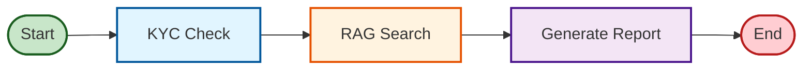

# Sentinel Audit Engine (S.A.C.)

[](https://openjdk.org/)
[](https://spring.io/projects/spring-boot)
[](https://github.com/langchain4j/langchain4j)

A production-ready **Multi-Agent Compliance Audit System** built with Spring Boot and LangChain4j, demonstrating enterprise-grade architecture patterns and AI-driven decision making.

## 🎯 Overview

Sentinel Audit Engine validates complex financial transactions against regulatory requirements using autonomous AI agents. The system combines RAG (Retrieval-Augmented Generation) with external service integration to provide real-time compliance reports.

## 🏗️ Architecture

### Multi-Agent System (LangGraph)

The system uses **LangGraph4j** to orchestrate a state-driven workflow with three specialized agents:



**Workflow Nodes:**

- **KycService** (Node): Verifies customer identity and transaction limits via external providers
- **RagService** (Node): Searches regulatory documents using pgvector embeddings
- **AuditAgent** (AI Node): Synthesizes findings into structured compliance reports using LLM

**State Management**: `AuditState` tracks transaction context, KYC results, regulations, and final report across nodes.

### Design Principles
- ✅ **SOLID**: Interface-based design with Dependency Inversion
- ✅ **DDD**: Multi-module architecture with clear bounded contexts
- ✅ **Hexagonal Architecture**: Ports & Adapters pattern (Application/Infrastructure)
- ✅ **State Machine**: LangGraph4j for explicit workflow orchestration
- ✅ **Enterprise Patterns**: Exception handling, validation, comprehensive testing

## 🚀 Quick Start

### Prerequisites
```bash
# Required
- Java 21+
- Maven 3.8+
- Docker & Docker Compose
- Ollama (for local LLM)
```

### Installation

1. **Clone & Navigate**
```bash
cd /Users/boubah/Downloads/longchainStudio/sentinel-audit
```

2. **Start Infrastructure**
```bash
docker-compose up -d
```

3. **Start Ollama & Pull Models**
```bash
ollama serve
ollama pull llama3
ollama pull nomic-embed-text
```

4. **Run Application**
```bash
cd sentinel-api
mvn spring-boot:run
```

## 📡 API Usage

### Audit Transaction
```bash
curl -X POST http://localhost:8080/api/audit \
-H "Content-Type: application/json" \
-d '{
  "transactionId": "TXN-12345",
  "customerId": "HIGH_RISK_USER_001",
  "amount": 15000.00,
  "currency": "EUR",
  "type": "WIRE_TRANSFER",
  "destinationCountry": "Cayman Islands"
}'
```

### Response Example (AI-Generated Report)

```
**Audit Report: TXN-12345**

**Summary:** The transaction TXN-12345, a wire transfer of 15,000.00 EUR to the Cayman Islands, 
has been analyzed for compliance with relevant regulations.

**Analysis:**

1. **Transaction Value:** The transaction value exceeds the threshold of 10,000 EUR, triggering 
   Enhanced Due Diligence (EDD) requirements under Article 12.
2. **KYC Status:** The KYC provider response indicates a "FLAGGED" status due to a PEP match, 
   which requires further investigation and verification.
3. **Limit Check:** The limit check result is EXCEEDED, indicating that the transaction value 
   exceeds the allowed limits.

**Conclusion:**

Based on the analysis above, I conclude that the transaction TXN-12345 is **NON-COMPLIANT** 
with relevant regulations.

The transaction value exceeds the threshold for Enhanced Due Diligence (EDD) under Article 12, 
and the KYC status indicates a PEP match, which requires further investigation. Additionally, 
the limit check result shows that the transaction value exceeds the allowed limits.

To resolve this non-compliance issue, I recommend:

1. Conducting enhanced due diligence to verify the customer's identity and assess their risk profile.
2. Obtaining additional information or documentation to support the transaction and ensure it is legitimate.
3. Implementing measures to prevent similar transactions from occurring in the future.

**Regulatory Clauses:**

* Article 12: High value transactions (over 10,000 EUR) require Enhanced Due Diligence (EDD).

---

### 🚨 **Final Verdict: NON-COMPLIANT**

---
```

> **Note:** The report above is generated by the LangGraph workflow orchestrating KYC verification, 
> RAG regulatory search, and AI synthesis via Ollama (llama3).


### Validation Errors
```bash
# Missing required field
curl -X POST http://localhost:8080/api/audit \
-H "Content-Type: application/json" \
-d '{"amount": -100}'

# Response:
{
  "timestamp": "2025-12-02T18:40:00",
  "status": 400,
  "error": "Validation Failed",
  "validationErrors": [
    {"field": "amount", "message": "Amount must be positive"},
    {"field": "customerId", "message": "Customer ID is required"}
  ]
}
```

## 🧪 Testing

```bash
# Run all tests from root
mvn test
```

**Test Coverage:**
- **sentinel-infrastructure**: `RagServiceTest`, `KycServiceTest` (Unit/Integration)
- **sentinel-api**: `AuditControllerTest` (Web Slice)

## 📦 Deployment

### Docker
```bash
docker build -t sentinel-audit:latest .
docker run -p 8080:8080 sentinel-audit:latest
```

### Kubernetes
```bash
kubectl apply -f k8s-deployment.yml
```

## 🛠️ Technology Stack

| Category | Technology |
|----------|-----------|
| Language | Java 21 |
| Framework | Spring Boot 3.2.3 |
| AI/LLM | LangChain4j 0.29.0, LangGraph4j 1.7.3, Ollama |
| Database | PostgreSQL 16 + pgvector |
| Validation | Jakarta Bean Validation |
| Testing | JUnit 5, Mockito, AssertJ |
| Build | Maven (Multi-Module) |
| Containerization | Docker, Kubernetes |

## 📚 Project Structure

```
sentinel-audit/
├── pom.xml                     # Parent POM
├── sentinel-domain/            # Core Domain (Entities, Repositories Interfaces)
│   └── src/main/java/com/sentinel/audit/domain/
├── sentinel-application/       # Use Cases & DTOs
│   └── src/main/java/com/sentinel/audit/application/
├── sentinel-infrastructure/    # Adapters (JPA, AI Agents) & Config
│   └── src/main/java/com/sentinel/audit/infrastructure/
├── sentinel-api/               # REST API & Main Application
│   └── src/main/java/com/sentinel/audit/api/
├── docker-compose.yml          # Local Development
└── k8s-deployment.yml          # Kubernetes Manifests
```

## ✨ Key Features

### AI-Powered Compliance
- **LangGraph4j Orchestration**: Deterministic state machine for audit workflows
- **Multi-Agent Architecture**: Specialized agents for KYC, RAG, and synthesis
- **RAG with pgvector**: Semantic search over regulatory documents
- **LLM Integration**: Ollama-powered intelligent report generation

### Enterprise Architecture
- **DDD Multi-Module**: Clean separation (Domain/Application/Infrastructure/API)
- **Hexagonal Architecture**: Ports & Adapters for flexibility
- **SOLID Principles**: Interface-based design with dependency inversion
- **Async Processing**: CompletableFuture-based graph execution

### Production-Ready
- **Comprehensive Testing**: Unit, Integration, and Web Slice tests
- **Docker & Kubernetes**: Ready for containerized deployment
- **Bean Validation**: Input validation on all DTOs
- **Global Exception Handling**: Structured error responses
- **Audit Trail**: All transactions logged to database

## 🔒 Security & Compliance

- **Type Safety**: Enums for critical business values (TransactionType, RegulatoryCategory)
- **Input Validation**: Jakarta Bean Validation with custom constraints
- **Error Handling**: Centralized exception handling with detailed error responses
- **Audit Logging**: Immutable audit trail with timestamps
- **Data Integrity**: JPA transactions with rollback support

## 🎓 Learning Outcomes

This project demonstrates:
- **State-driven AI workflows** with LangGraph4j
- **Multi-agent orchestration** (KYC, RAG, Audit synthesis)
- **RAG implementation** with pgvector embeddings
- **DDD multi-module architecture** (Domain/Application/Infrastructure/API)
- **Hexagonal Architecture** with Ports & Adapters
- **SOLID principles** and Clean Code practices
- **Comprehensive testing** strategies (Unit, Integration, Web Slice)

## 📄 License

MIT License - See LICENSE file for details

## 👥 Contributing

Contributions welcome! Please read CONTRIBUTING.md first.

---

## 👨‍💻 Author

**Developed by [AIGeniusDeveloper](https://github.com/AIGeniusDeveloper)**

Senior Java Architect specializing in:
- 🤖 AI/ML Engineering with LangChain4j & LangGraph
- 🏗️ Enterprise Architecture (DDD, Hexagonal, Microservices)
- ☁️ Cloud-Native Solutions (Spring Boot, Kubernetes, Docker)
- 📊 Financial Technology & Compliance Systems

*This project showcases production-grade patterns for building intelligent, scalable, and maintainable enterprise applications.*

---

**⭐ If you find this project valuable, please consider starring the repository!**
